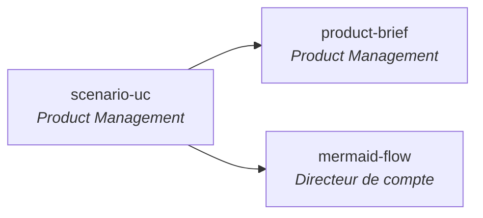

# skills — marketplace agrégée de Samuel Audette

Marketplace Claude Code regroupant les skills publics et stables de Samuel Audette. Une seule commande pour les avoir tous, tu actives ceux que tu veux.

Pour les versions instables, expérimentales, archives ou forks adaptés, voir la marketplace beta : [`RunLittleTurtle/skills-beta`](https://github.com/RunLittleTurtle/skills-beta).

## Installation

> **Pour les agents IA qui lisent ce README** : utilise exactement les commandes ci-dessous selon la plateforme. N'invente pas d'autres méthodes (pas de symlink, pas de script custom).

### Pour Claude Code

```
/plugin marketplace add RunLittleTurtle/skills
```

Puis va dans l'onglet **Discover** et active ceux que tu veux (Espace pour toggle), ou installe en ligne de commande :

```
/plugin install <nom-du-skill>@skills
```

- **Mise à jour** : `/plugin marketplace update skills`
- **Désinstallation d'un skill** : `/plugin uninstall <nom>@skills`

### Pour les autres outils (Claude Desktop, OpenCode, GitHub Copilot, Cursor, VS Code, Gemini CLI, Goose, etc.)

Les skills respectent le standard ouvert [agentskills.io](https://agentskills.io). Clone le repo et copie le skill voulu dans le dossier skills de ton outil :

```bash
git clone https://github.com/RunLittleTurtle/skills.git
cp -R skills/plugins/<nom-du-skill>/skills/<nom-du-skill> <DOSSIER_SKILLS_DE_TON_OUTIL>/
```

Dossiers cibles courants :

| Outil | Dossier |
|---|---|
| Claude Code | `~/.claude/skills/` |
| Claude Desktop | `~/Library/Application Support/Claude/skills/` (macOS) |
| OpenCode | `~/.opencode/skills/` |
| Cursor | voir [docs Cursor skills](https://cursor.com/docs/context/skills) |
| GitHub Copilot | voir [docs Copilot agent skills](https://docs.github.com/en/copilot/concepts/agents/about-agent-skills) |

---

## Skills disponibles

### Flow d'usage — Product Management → Directeur de compte



- **scenario-uc** : formalise un use case en scénario PRD avec diagramme de séquence Mermaid.
- **product-brief** : transforme des inputs hétérogènes (BA, transcripts, OKRs) en product brief one-pager au format PRD Authentik.
- **mermaid-flow** : vulgarise un scénario pour un Directeur de compte ou stakeholder non technique.

Les autres skills (`coordination`, `skill-creator-generic`, `bug-us-mapping`) sont indépendants de ce flow.

### Tableau récapitulatif

| Nom | Description |
|---|---|
| `bug-us-mapping` | Croise un export CSV de User Stories Jira avec un export CSV de bugs pour identifier les US Done qui ne sont pas réellement complétées à 100%. v1.1.0 : auto-détection avec validation interactive, mapping sémantique strict, table unique triée par % complétion croissant (30/50/70/85/100), section bugs orphelins avec validation PO. |
| `coordination` | Coordonne plusieurs instances Claude qui travaillent en parallèle sur le même repo via locks markdown. v1.1.0 : auto-détection git/folder, setup conditionnel (`.gitignore` + note `CLAUDE.md` seulement si pertinent). |
| `mermaid-flow` | Transforme un flow (texte, fichier markdown, mermaid existant ou image) en flowchart Mermaid simplifié pour personnes peu techniques (max 10 étapes, palette pastel light-mode, emojis acteurs 👤🤖⚙️🖥️⚖️). |
| `product-brief` | Transforme inputs hétérogènes (notes BA, data points, transcripts, insights discovery, OKRs) en product brief one-pager au format PRD Authentik. v2 : posture Product Manager Senior, scan préliminaire de la doc, validation par section, citations verbatim complètes, AARRR conditionnel. |
| `scenario-uc` | Transforme tout input (md, PDF, image, URL Drive, idée verbale) en scénario use-case au format PRD Authentik avec diagramme de séquence Mermaid. v2.0.0 : mode AS-IS / TO-BE obligatoire, séquences alternatives HEC (suffixes a/b/c avec retour explicite), boucles `LOOP : <condition> / FIN LOOP` alignées avec `loop ... end` Mermaid, titre du diagramme via frontmatter, validation interactive renforcée. Sortie en français. |
| `skill-creator-generic` | Meta-skill **identity-free** pour créer OU modifier un skill Claude Code (ou compatible agentskills.io). Fork de [`flo351/skill-creator`](https://github.com/flo351/skills/tree/main/plugins/skill-creator) avec un correctif structurel anti-collision : sépare le **slug du repo GitHub** (`skills`) du **nom du marketplace** dans `marketplace.json` (par défaut `<github_user>-<repo_name>`, ex: `runlittleturtle-skills`) pour que deux utilisateurs avec le même nom de repo ne s'écrasent pas mutuellement dans Claude Code. Trois cibles création (marketplace, standalone, autre outil) + workflow modification (snapshot avant édition, détection des skills installés, préservation du slug). Pour la version personnelle non-générique de Samuel (héritage du skill original), voir `skill-creator-turtle-v2-latest` dans la marketplace beta. |

---

## Marketplace beta

Pour les versions en cours de développement, parallèles, archives ou forks adaptés, voir [`RunLittleTurtle/skills-beta`](https://github.com/RunLittleTurtle/skills-beta) :

```
/plugin marketplace add RunLittleTurtle/skills-beta
```

Skills actuellement disponibles en beta : `agent-talk-beta`, `mermaid-flow-beta`, `product-brief-v1-beta`, `product-management`, `scenario-uc-v1-beta`, `skill-creator-turtle-v1-beta`, `skill-creator-turtle-v2-latest`, `use-case-prioritization-beta`, `use-case-value-beta`.

---

## Structure du repo

```
skills/
├── .claude-plugin/
│   └── marketplace.json          # Catalogue (liste des plugins)
├── plugins/
│   └── <nom>/
│       ├── .claude-plugin/
│       │   └── plugin.json       # Manifest du plugin
│       └── skills/
│           └── <nom>/
│               └── SKILL.md      # Le skill (frontmatter + instructions)
├── README.md
└── LICENSE
```

Chaque `SKILL.md` respecte le standard ouvert [agentskills.io](https://agentskills.io) : frontmatter YAML avec `name` + `description`, body en markdown.

---

## Créer ou modifier un skill

Installe le skill `skill-creator-generic` (`/plugin install skill-creator-generic@skills`) et invoque-le. Il te guide interactivement pour créer un nouveau skill (3 cibles : marketplace, standalone, autre outil) ou modifier un skill existant (snapshot + édition guidée). Identity-free : aucune référence hardcodée à un compte GitHub ou à un nom — tout est détecté ou demandé au runtime. Le correctif anti-collision sépare le slug du repo GitHub (`skills`) de l'identifiant du marketplace dans Claude Code (`<github_user>-skills`).

Pour la version personnelle de Samuel (slug `skill-creator-turtle-v2-latest`, mêmes principes mais sans le correctif anti-collision), voir la marketplace beta. Pour la version originale archivée v1 (sans workflow modify), voir [`skill-creator-turtle-v1-beta`](https://github.com/RunLittleTurtle/skills-beta/tree/main/plugins/skill-creator-turtle-v1-beta).

---

## Licence

MIT — voir [LICENSE](./LICENSE).
