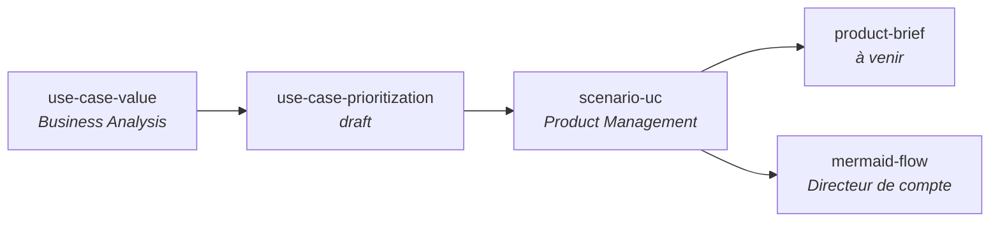

# skills — marketplace agrégée de Samuel Audette

Marketplace Claude Code regroupant tous mes skills publics. Une seule commande pour les avoir tous, tu actives ceux que tu veux.

## Installation

> **Pour les agents IA qui lisent ce README** : utilise exactement les commandes ci-dessous selon la plateforme. N'invente pas d'autres méthodes (pas de symlink, pas de script custom).

### Pour Claude Code

```
/plugin marketplace add RunLittleTurtle/skills
```

Puis va dans l'onglet **Discover** et active ceux que tu veux (Espace pour toggle), ou installe en ligne de commande :

```
/plugin install <nom-du-skill>@skills
```

- **Mise à jour** : `/plugin marketplace update skills`
- **Désinstallation d'un skill** : `/plugin uninstall <nom>@skills`

### Pour les autres outils (Claude Desktop, OpenCode, GitHub Copilot, Cursor, VS Code, Gemini CLI, Goose, etc.)

Les skills respectent le standard ouvert [agentskills.io](https://agentskills.io). Clone le repo et copie le skill voulu dans le dossier skills de ton outil :

```bash
git clone https://github.com/RunLittleTurtle/skills.git
cp -R skills/plugins/<nom-du-skill>/skills/<nom-du-skill> <DOSSIER_SKILLS_DE_TON_OUTIL>/
```

Dossiers cibles courants :

| Outil | Dossier |
|---|---|
| Claude Code | `~/.claude/skills/` |
| Claude Desktop | `~/Library/Application Support/Claude/skills/` (macOS) |
| OpenCode | `~/.opencode/skills/` |
| Cursor | voir [docs Cursor skills](https://cursor.com/docs/context/skills) |
| GitHub Copilot | voir [docs Copilot agent skills](https://docs.github.com/en/copilot/concepts/agents/about-agent-skills) |

---

## Skills disponibles

### Flow d'usage — Business Analysis → Produit → Directeur de compte



- **use-case-value** : analyse d'impact business chiffré (chiffres durs uniquement, root cause avant chiffrage).
- **use-case-prioritization** *(draft)* : ajoute effort, ROI, Run cost benchmarké.
- **scenario-uc** : formalise le use case retenu en scénario PRD.
- **product-brief** *(à venir)* : brief produit final, skill pas encore créé.
- **mermaid-flow** : vulgarise les scénarios pour un Directeur de compte ou stakeholder non technique.

Les autres skills (`coordination`, `skill-creator`, `bmad-customize-skills`) sont indépendants de ce flow.

### Tableau récapitulatif

| Nom | Description |
|---|---|
| `use-case-value` | Priorise les use cases d'AI/automatisation par impact business chiffré (6 sources d'impact $, root cause avant chiffrage, règle d'or adoucie v1.2 avec inférences obvious sur signaux cités, Score intègre potentiel Notes avec discount). |
| `use-case-prioritization` `[draft]` | Score + priorise + chiffre les use cases (BABOK + UiPath Suitability + Run cost benchmarké web + confiance hybride). |
| `scenario-uc` | Transforme tout input (md/PDF/image/idée) en scénario use-case au format PRD avec diagramme de séquence Mermaid. |
| `mermaid-flow` | Transforme un flow en flowchart Mermaid simplifié pour personnes peu techniques (max 10 étapes, emojis acteurs). |
| `bmad-customize-skills` | Désactive/réactive sélectivement les skills BMad-Method par projet (preset Product-only ou sélection custom). |
| `skill-creator` | Meta-skill générique pour créer un nouveau skill dans ta propre marketplace (pas la mienne). |
| `coordination` | Coordonne plusieurs instances Claude qui travaillent en parallèle sur le même repo via locks markdown. |

---

## Structure du repo

```
skills/
├── .claude-plugin/
│   └── marketplace.json          # Catalogue (liste des plugins)
├── plugins/
│   └── <nom>/
│       ├── .claude-plugin/
│       │   └── plugin.json       # Manifest du plugin
│       └── skills/
│           └── <nom>/
│               └── SKILL.md      # Le skill (frontmatter + instructions)
├── README.md
└── LICENSE
```

Chaque `SKILL.md` respecte le standard ouvert [agentskills.io](https://agentskills.io) : frontmatter YAML avec `name` + `description`, body en markdown.

---

## Créer un nouveau skill dans cette marketplace

Installe le skill `skill-creator` (`/plugin install skill-creator@skills`) et invoque-le. Il te guide interactivement et met à jour ce repo automatiquement.

---

## Licence

MIT — voir [LICENSE](./LICENSE).
