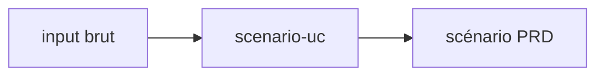

# scenario-uc

> Transformer n'importe quel input (texte, brouillon md, PDF, image, URL Drive, idée verbale) en un fichier markdown de scénario use-case au format Authentik PRD complet : description, intent, séquence textuelle numérotée avec séquences alternatives HEC (suffixes a/b/c) et boucles LOOP/FIN LOOP, diagramme de séquence Mermaid avec titre via frontmatter et bloc `loop ... end` natif, préfixe AS-IS / TO-BE dans le H1. Analyse profonde + validation interactive renforcée avant génération. Sortie en français.

- **Créé** : `2026-05-08`
- **Dernière mise à jour** : `2026-05-15`



## Installation

```
/plugin marketplace add RunLittleTurtle/skills
/plugin install scenario-uc@skills
```

Slash : `/scenario-uc`. Mise à jour : `/plugin marketplace update skills`.

## Licence

MIT — voir [LICENSE](../../LICENSE).
