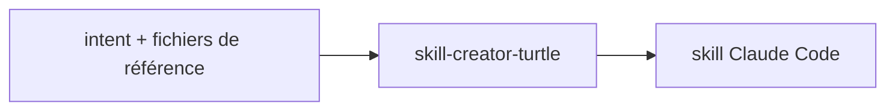

# skill-creator-turtle

> Créer un nouveau skill Claude Code OU modifier un skill existant, dans une marketplace personnelle (Type A), en standalone perso (Type B), ou pour un autre outil compatible agentskills.io (Type C). Détecte automatiquement les fichiers de référence passés en argument et les skills installés sur la machine. Préserve le slug d'origine lors d'une modification, snapshot le skill dans `/tmp/` avant édition. Persiste la config dans `~/.claude/skill-creator-turtle/config.json` (clés stable + beta_*). À invoquer quand l'utilisateur veut créer ou modifier un skill, peu importe son setup ou ses intentions.

- **Créé** : `2026-05-08`
- **Dernière mise à jour** : `2026-05-15`



## Installation

```
/plugin marketplace add RunLittleTurtle/skills
/plugin install skill-creator-turtle@skills
```

Slash : `/skill-creator-turtle`. Mise à jour : `/plugin marketplace update skills`.

## Licence

MIT — voir [LICENSE](../../LICENSE).
