# <slug>

> <description complète, identique au champ `description` du frontmatter de SKILL.md et de plugin.json>

- **Créé** : `<YYYY-MM-DD>`
- **Dernière mise à jour** : `<YYYY-MM-DD>`



```mermaid
flowchart LR
    A[<input principal>] --> B[<slug>]
    B --> C[<output principal>]
```

## Installation

```
/plugin marketplace add <github_user>/<repo_name>
/plugin install <slug>@<repo_name>
```

Slash : `/<slug>`. Mise à jour : `/plugin marketplace update <repo_name>`.

## Licence

MIT — voir [LICENSE](../../LICENSE).

<!--
Substitutions à faire au moment de la génération (skill-creator-turtle Étape 7 Type A) :

- <slug>           : valeur saisie à l'Étape 3
- <description>    : valeur saisie à l'Étape 4 (description complète, telle quelle)
- <YYYY-MM-DD>     : date du jour (`date +%Y-%m-%d`). À la création, les deux dates valent le jour courant. À la modification (M.7), seule la ligne "Dernière mise à jour" est repatchée ; "Créé" est immuable.
- <input principal>  : entrée principale du skill (ex: "fichier markdown", "post-its", "transcript", "URL Drive"). 1-3 mots.
- <output principal> : sortie principale (ex: "scénario PRD", "flowchart Mermaid", "rapport CSV", "skill généré"). 1-3 mots.
- <github_user>    : config.github_user (mode github) ; sinon chemin local
- <repo_name>      : `repo_name` ou `beta_repo_name` selon le contexte choisi à l'Étape 0.1

Mode local : remplace `/plugin marketplace add <github_user>/<repo_name>` par `/plugin marketplace add <repo_dir>` (chemin absolu).

Pas de section "Use case" ni "Contenu" ni "Pour les autres outils" — le README du repo racine couvre déjà l'installation multi-outils, et la description du frontmatter (citée en blockquote ci-dessus) tient lieu de use case. Garder le README plugin à l'essentiel : titre + description + dates + mermaid + install + licence. Cible ≤ 25 lignes hors commentaire.
-->
